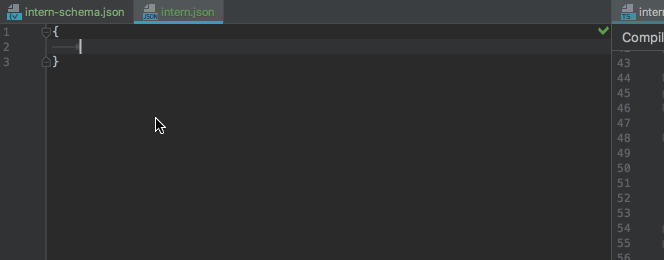

# JSON Schema for Intern 4

This Json Schema for [Intern 4](https://theintern.io) testing framework defines the structure of your intern.json file.



## Usage

Install the schema to your project

```bash
	npm install intern-json-schema.git --save-dev
```

## WebStorm & Intellij

* Open Properties (CMD + , on Mac)
* Language & Frameworks
* Schemas & DTDs
* JSON Schema
* Add (+) `node_modules/intern-json-schema/intern-schema.json`
* Add JSON Schema Mapping for `intern.json`
* OK
